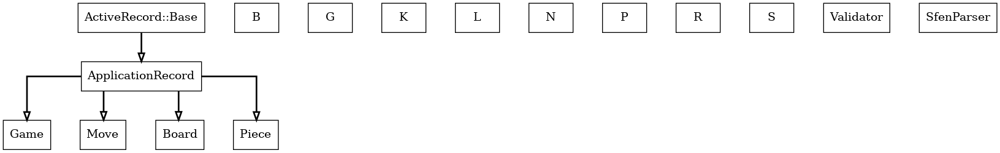

## 将棋GUI
- docker compose upで起動する
- 対局の開始から詰みまでルール通りに動く
## 構成
スキーマ駆動でやっている
- front
  - vue
  - api
    - typescript  
- backend
  - rails apiモード     

## クラスの継承関係


### 図の説明
- 実線矢印（⟶）：継承関係
- 点線矢印（- ->）：Concernsの関係
- 四角形：クラス
- 六角形：Concerns

## ER図

　
#### ER図
- カラスの足：has_many関係
- 線と丸：belongs_to関係
- 実線：必須の関連
- 点線：オプションの関連

### 図の生成方法
```bash
# クラス図の生成
docker compose exec backend bundle exec rake diagram:generate

# ER図の生成
docker compose exec backend bundle exec rake erd:generate
```